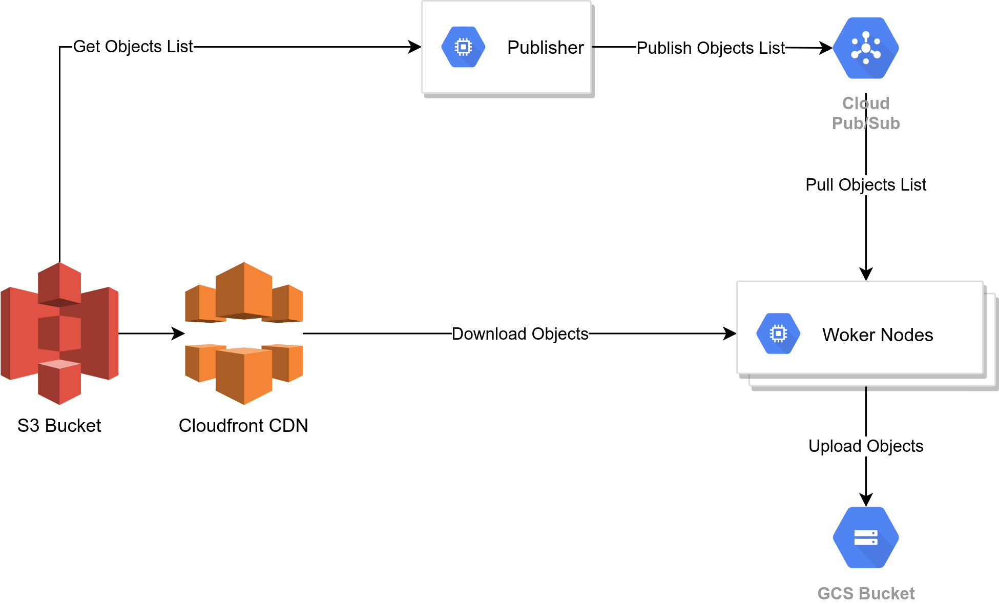

# AWS S3 to GCS data transfer using Cloudfront CDN

- This tool is designed to transfer data from an S3 bucket to a GCS bucket using Cloudfront CDN.

## Architecture



- Publisher program lists the bucket objects and its metadata using boto3 client and psuhes the list to a Pub/Sub topic.
- One or more worker instances then pulls object config list and uses it to transfer data from S3 bucket to GCS bucket

## Features

- Generates list of object config (url and object metadata) present in the S3 bucket using boto3 client and pushes it to Pub/Sub.
- As Pub/Sub is used for URL list, more instances can be added in parallel to increase data transfer rate.
- Can use signed URL (custom policy) with Cloudfront.
- Multithreaded transfer

## Limitations

- It can transfer objects from a single S# bucket to a single GCS bucket.
- Either it can use signed URL or public URL at a time.

## Publisher configuration

- Configure publisher program variables in `publisher/config.py`

## Worker configuration

- Configure publisher program variables in `worker/config.py`

## Logging

- Logs are pushed to the Cloud Logging service corresponding to the configured GCP project.
- Log name is defined in `config.py`
- Following logs are generated by publisher program:
    1. MAIN program exception traceback:
        ```
        {
            "message": "MAIN_PROGRAM_ERROR",
            "program": "PUBLISHER",
            "error": traceback.format_exc()
        }
        ```
    2. Messages published to Pub/Sub (if `VERBOSE_LOG` is set to `True` in `publisher/config.py`)
- Following logs are generated by publisher program:
    1. MAIN program exception traceback:
        ```
        {
            "message": "MAIN_PROGRAM_ERROR",
            "program": "PUBLISHER",
            "error": traceback.format_exc()
        }
        ```
    2. Object initiated logs (if `VERBOSE_LOG` is set to `True` in `worker/config.py`)
    3. File IO error logs
    4. pyCurl error logs
    5. pyCurl unexpected response logs
    6. GCS object upload failure logs

## Object transfer failure handling

- In case if there is file handling exceptions then the object information if pushed to `PUBSUB_ERROR_TOP_ID` Pub/Sub topic defined in `worker/config.py`.
- In case if object is not downloaded (if status code is other than 200 or pyCurl error) then the object information if pushed to `PUBSUB_ERROR_TOP_ID` Pub/Sub topic defined in `worker/config.py`.
- Same applies to GCS upload error also.

## Steps to install pyCurl library

